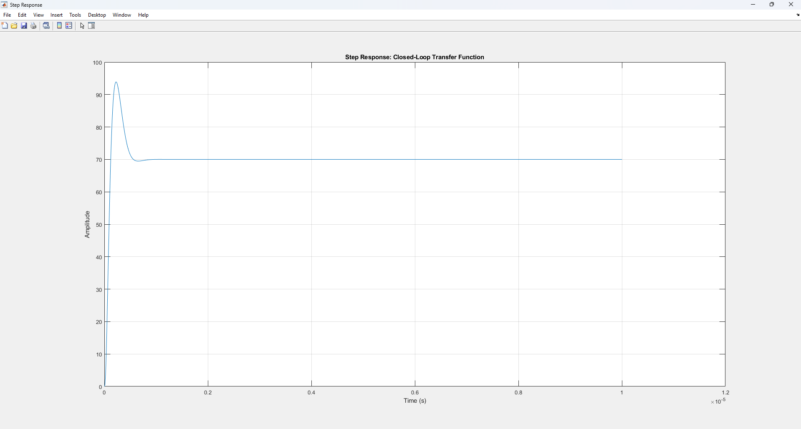
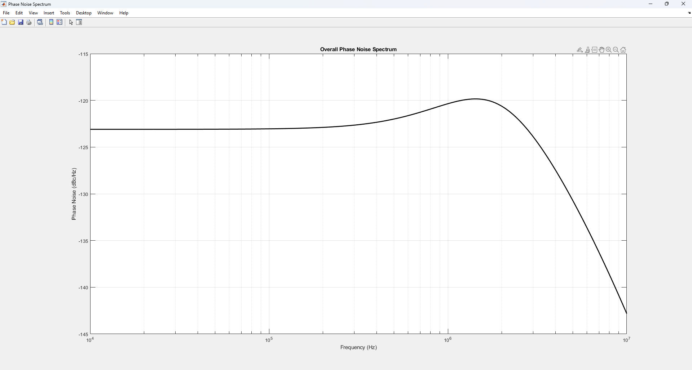
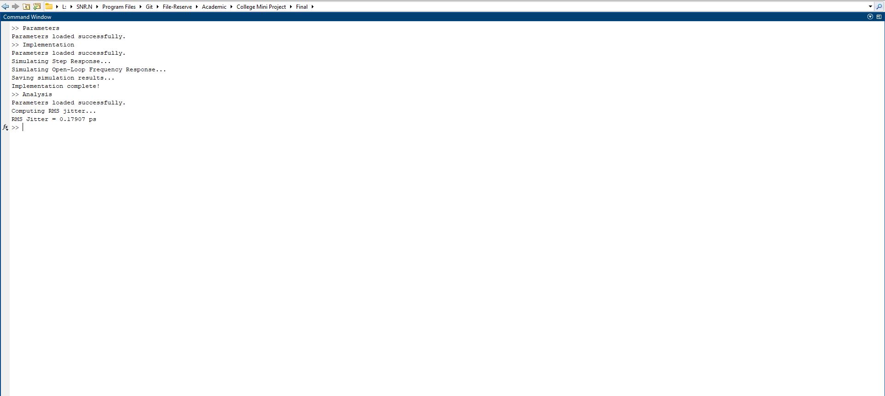

# **PLL Simulation Outputs**

This document describes the outputs generated during the simulation and analysis of the Phase-Locked Loop (PLL) system. These include key plots and data files created by the scripts.

---

## **1. Output Plots**

### **1.1. Closed-Loop Transfer Function**

- **Description**: 
  - This plot represents the step response of the closed-loop transfer function (`CL_TF`).
  - It shows the system's time-domain behavior in response to a step input.
- **Generated By**: `implementation.m`
- **Key Features**:
  - Time (x-axis) vs. Amplitude (y-axis).
  - Highlights the system's settling time, overshoot, and stability.

---

### **1.2. Open-Loop Frequency Response**

- **Description**: 
  - This plot represents the magnitude response of the open-loop transfer function (`OL_GAIN`) in the frequency domain.
  - It provides insights into the system's gain and phase characteristics over a wide frequency range.
- **Generated By**: `implementation.m`
- **Key Features**:
  - Frequency (logarithmic scale, x-axis) vs. Magnitude in dB (y-axis).
  - Highlights open-loop gain and bandwidth.

---

### **1.3. Overall Phase Noise Spectrum**

- **Description**: 
  - This plot shows the overall phase noise spectrum at the output of the PLL.
  - Combines phase noise contributions from the reference, charge pump, and VCO.
- **Generated By**: `analysis.m`
- **Key Features**:
  - Frequency (logarithmic scale, x-axis) vs. Phase Noise in dBc/Hz (y-axis).
  - Visualizes how phase noise varies across the frequency range.

---

### **1.4. Command Window Output**

- **Description**: 
  - A screenshot of the MATLAB command window showing the progress of simulations and the computed RMS jitter.
  - Confirms successful execution of all steps in `implementation.m` and `analysis.m`.
- **Key Details**:
  - RMS jitter value (in picoseconds) displayed as part of the output.

---

## **2. Data File**

### **2.1. Simulation Results**
- **File Name**: `Implementation_Results.mat`
- **Description**: 
  - A MATLAB `.mat` file containing the results of the simulations performed in `implementation.m`.
  - Includes all necessary data for post-simulation analysis in `analysis.m`.
- **Contents**:
  - `t`: Time vector for step response.
  - `y`: Step response data.
  - `w`: Frequency vector for open-loop response.
  - `mag`: Magnitude response of the open-loop system.
  - `phase`: Phase response of the open-loop system.
  - `mag_dB`: Magnitude response in dB.

---

## **Usage Notes**
1.  `.png` files used for visual analysis of PLL system behavior.
2. The `.mat` file can be loaded into MATLAB for further processing or custom analysis.
3. Ensure that `Implementation_Results.mat` is in the MATLAB path before running `analysis.m`.

--- 

## **Conclusion**
These outputs collectively provide a comprehensive understanding of the PLL system's performance in both time and frequency domains. The plots and data are critical for evaluating stability, phase noise, and jitter.
