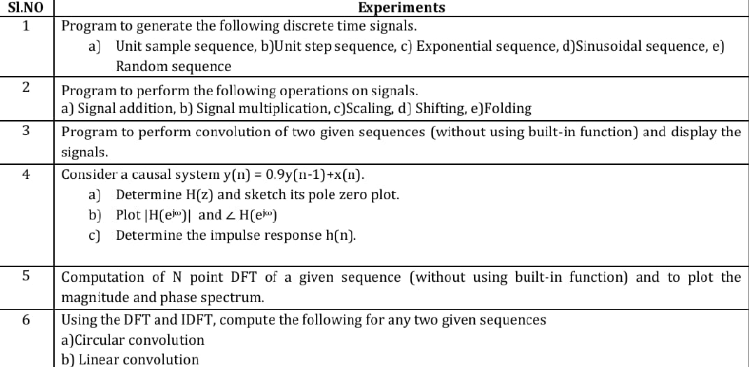

# Signal Processing Experiments: Comprehensive Study Guide

---
## Reference Overview


---

## Common Components Across All Experiments

1. **Initialization**:
   At the start of each MATLAB program:
   ```matlab
   clc;
   clear all;
   close all;
   ```
   - `clc`: Clears the command window.
   - `clear all`: Clears variables from memory.
   - `close all`: Closes all open figure windows.

2. **Key MATLAB Operations**:
   - **Addition**: `y = x1 + x2;`
   - **Multiplication**: `y = x1 .* x2;`
   - **Scaling**: `y = a * x;`
   - **Shifting**: Used for right or left shift of signals, `y(n-k)` or `y(n+k)`.
   - **Folding**: Reverses the signal sequence, `y = flip(x);`.

---

## Experiment 1: Sequence Generation

### Objective:
Generate and analyze common discrete-time sequences:
1. **Unit Sample Sequence**.
2. **Unit Step Sequence**.
3. **Exponential Sequence**.
4. **Sinusoidal Sequence**.
5. **Random Sequence**.

### Code:
```matlab
clc;
clear all;
close all;

% Unit Sample Sequence
n = -10:10;
unit_sample = [zeros(1, 10), 1, zeros(1, 10)];
subplot(3, 2, 1);
stem(n, unit_sample);
title('Unit Sample Sequence');
xlabel('n');
ylabel('Amplitude');

% Unit Step Sequence
unit_step = n >= 0;
subplot(3, 2, 2);
stem(n, unit_step);
title('Unit Step Sequence');
xlabel('n');
ylabel('Amplitude');

% Exponential Sequence
n = 0:10;
a = 0.5;
exp_seq = a .^ n;
subplot(3, 2, 3);
stem(n, exp_seq);
title('Exponential Sequence');
xlabel('n');
ylabel('Amplitude');

% Sinusoidal Sequence
freq = 0.1; % Normalized frequency
sin_seq = sin(2 * pi * freq * n);
subplot(3, 2, 4);
stem(n, sin_seq);
title('Sinusoidal Sequence');
xlabel('n');
ylabel('Amplitude');

% Random Sequence
random_seq = rand(1, 21);
subplot(3, 2, 5);
stem(-10:10, random_seq);
title('Random Sequence');
xlabel('n');
ylabel('Amplitude');
```

---

## Experiment 2: Signal Operations

### Objective:
Perform the following operations:
1. **Addition**.
2. **Multiplication**.
3. **Scaling**.
4. **Shifting**.
5. **Folding**.

### Code:
#### Addition:
```matlab
clc;
clear all;
close all;

n = 0:10;
x1 = sin(0.2 * pi * n);
x2 = cos(0.2 * pi * n);

% Addition of two signals
y_add = x1 + x2;
stem(n, y_add);
title('Addition of Two Signals');
xlabel('n');
ylabel('Amplitude');
```

#### Folding:
```matlab
clc;
clear all;
close all;

n = -10:10;
x = [zeros(1, 10), 1, zeros(1, 10)]; % Unit sample sequence

% Folding (time reversal)
folded_x = fliplr(x);

stem(n, folded_x);
title('Folding of Signal');
xlabel('n');
ylabel('Amplitude');
```

#### Scaling:
```matlab
clc;
clear all;
close all;

n = 0:10;
x = sin(0.2 * pi * n);

% Scaling
scaled_x = 2 * x;
stem(n, scaled_x);
title('Scaling of Signal');
xlabel('n');
ylabel('Amplitude');
```

---

## Experiment 3: Convolution

### Objective:
Perform convolution of two signals **manually** (without using MATLAB’s built-in `conv` function).

### Code:
```matlab
clc;
clear all;
close all;

% Two input sequences
x = [1, 2, 3];
h = [4, 5, 6];

% Manual convolution
len_x = length(x);
len_h = length(h);
result_len = len_x + len_h - 1;

y = zeros(1, result_len);

for i = 1:len_x
    for j = 1:len_h
        y(i + j - 1) = y(i + j - 1) + x(i) * h(j);
    end
end

stem(0:result_len-1, y);
title('Manual Convolution');
xlabel('n');
ylabel('Amplitude');
```

---

## Experiment 4: System Analysis (Pole-Zero Plot and Impulse Response)

### Objective:
Analyze the system \( y(n) = 0.9y(n-1) + x(n) \):
1. Determine the transfer function \( H(z) \).
2. Plot the **Pole-Zero Map**.
3. Determine the **Impulse Response** \( h(n) \).

### Code:
```matlab
clc;
clear all;
close all;

% Transfer function coefficients
num = [1]; % Numerator coefficients
den = [1, -0.9]; % Denominator coefficients

% Pole-zero map
zplane(num, den);
title('Pole-Zero Plot');

% Impulse response
impulse_response = filter(num, den, [1, zeros(1, 19)]);
figure;
stem(0:19, impulse_response);
title('Impulse Response');
xlabel('n');
ylabel('Amplitude');
```

---

## Experiment 5: DFT Computation

### Objective:
Compute the **N-point DFT** of a given sequence manually (without using MATLAB’s `fft` function).

### Code:
```matlab
clc;
clear all;
close all;

x = [1, 2, 3, 4]; % Input sequence
N = length(x);

% Manual DFT computation
Xk = zeros(1, N);
for k = 0:N-1
    for n = 0:N-1
        Xk(k+1) = Xk(k+1) + x(n+1) * exp(-1j * 2 * pi * k * n / N);
    end
end

% Magnitude and Phase
disp('DFT Magnitude:');
disp(abs(Xk));
disp('DFT Phase:');
disp(angle(Xk));
```

---

## Experiment 6: Circular and Linear Convolution

### Objective:
Use **DFT and IDFT** to compute:
1. **Circular Convolution**.
2. **Linear Convolution**.

### Code:
```matlab
clc;
clear all;
close all;

x = [1, 2, 3];
h = [4, 5, 6];

% Zero-padding for linear convolution
N = length(x) + length(h) - 1;
x_pad = [x, zeros(1, N - length(x))];
h_pad = [h, zeros(1, N - length(h))];

% Circular Convolution (DFT and IDFT)
Xk = fft(x_pad, N);
Hk = fft(h_pad, N);
Yk = Xk .* Hk;
y_circular = ifft(Yk);

% Linear Convolution
y_linear = conv(x, h);

disp('Circular Convolution:');
disp(y_circular);
disp('Linear Convolution:');
disp(y_linear);
```

---

This guide provides all the essential MATLAB codes and explanations for the six experiments.
