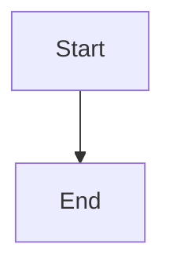
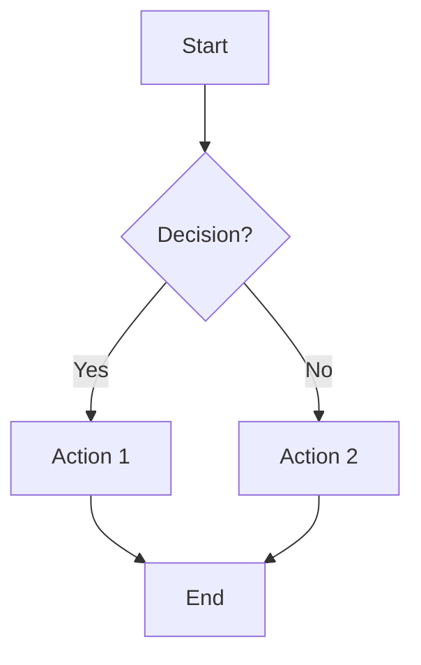
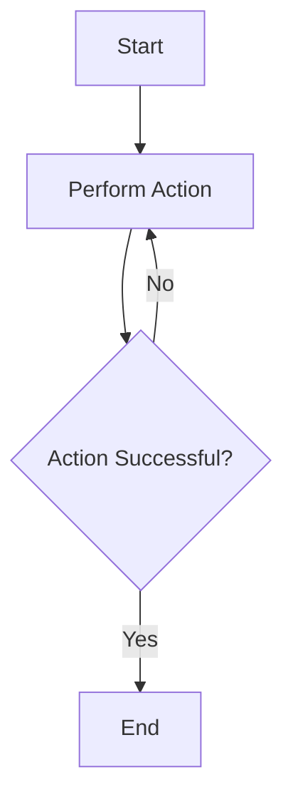
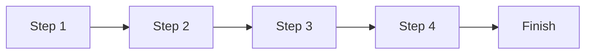
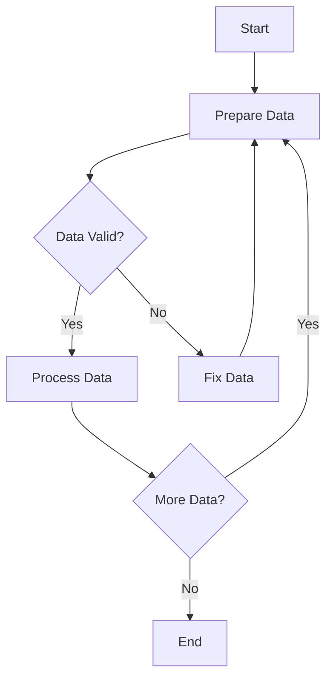
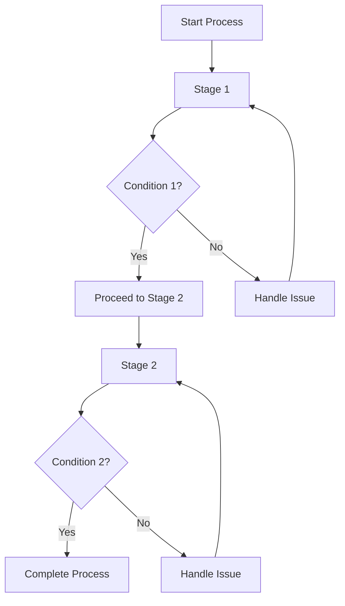
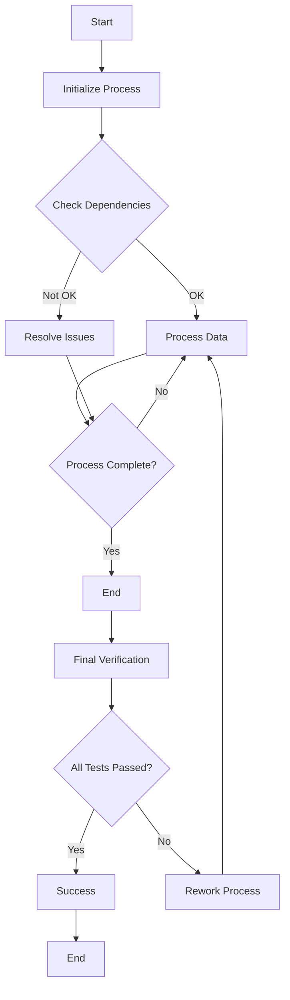

# Mermaid Block Diagram Examples with Code and Diagram Side by Side

This document demonstrates how to create block diagrams using Mermaid syntax. Each code snippet is shown alongside its diagram.

## Simple Block Diagram

Here is the simplest example of a block diagram with just a start and end:

### Explanation:
- `graph TD`: Top-down graph.
- `A[Start] --> B[End]`: A simple flow from start to end.

---

## Conditional Flow

Next, we introduce a conditional flow that branches based on a decision.

### Explanation:
- The diagram uses a decision block (`B{Decision?}`) to branch the flow.

---

## Process with Loop

This example includes a process with a loop where actions are repeated until a condition is met.

### Explanation:
- The loop will continue if the action is not successful, repeating until it is.

---

## Sequential Process Flow

Here is a sequential flow showing multiple steps in a process.

### Explanation:
- Each step occurs in order from left to right.

---

## Complex Process with Multiple Conditions

Here is a more complex block diagram involving multiple decision points.

### Explanation:
- The flow checks if the data is valid. If not, it fixes the data and re-processes it.
- It also loops if there’s more data to process.

---

## Multi-Stage Decision Process

A more advanced example with multiple stages and decision points:

### Explanation:
- The flow moves through two stages with multiple conditions and decision points at each stage.

---

## Final Complex Flow with Multiple Parallel Paths

Finally, a very complex flow showing parallel paths with interdependencies.

### Explanation:
- The diagram uses both conditional branches and parallel paths to handle various scenarios.
- After the main process, final verification tests are performed, determining success or failure.

---

## Rendering Mermaid Diagrams

To render Mermaid diagrams:
- You need a platform that supports Mermaid, such as GitHub, GitLab, or some Markdown editors like Typora or Visual Studio Code with the appropriate extensions.
