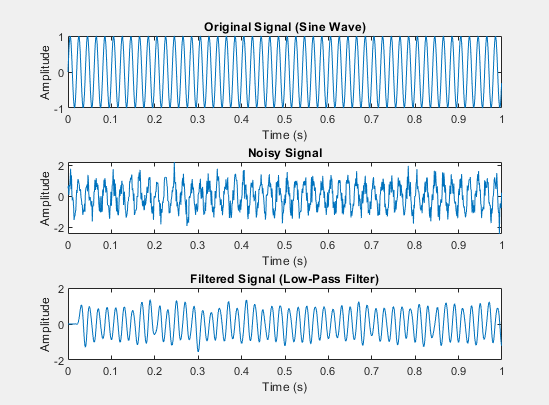
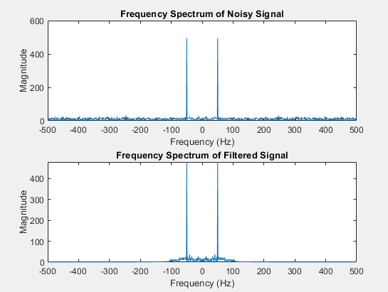

# Signal Processing Project: Noise Removal Using Low-Pass Filter in MATLAB

## Title:
**Noise Removal in Signals Using Low-Pass Filtering in MATLAB**

---

## Theory:

Signal processing is a field that focuses on analyzing, modifying, and synthesizing signals. One common problem in signal processing is the presence of noise, which can degrade the quality and accuracy of a signal. In this project, we simulate a noisy signal by adding Additive White Gaussian Noise (AWGN) to an original signal and then attempt to remove the noise using a low-pass filter.

### Key Concepts:
- **Additive White Gaussian Noise (AWGN):** This is a type of noise commonly added to signals in simulations. It has a flat spectral density and is Gaussian distributed in the time domain.
  
- **Low-Pass Filter:** A low-pass filter allows frequencies below a certain cutoff frequency to pass through while attenuating higher frequencies. This is useful for removing high-frequency noise from a signal.

- **Fast Fourier Transform (FFT):** The FFT is used to convert a time-domain signal into its frequency-domain representation. This helps in visualizing the frequency content of the signal and the effect of filtering.

### Objective:
The goal of this project is to:
1. Generate an original signal (sine wave).
2. Add AWGN to the signal to simulate noise.
3. Apply a low-pass filter to remove the noise.
4. Analyze and compare the signal in both time and frequency domains.

---

## Block Diagram:

```
+------------------+       +-------------------+       +----------------+       +------------------+
 |   Original      |------>|     Add Noise     |------>|   Filtered     |------>|   Frequency      |
 |   Signal        |       |     (AWGN)        |       |   Signal       |       |   Analysis       |
+------------------+       +-------------------+       +----------------+       +------------------+
                                                                 |
                                                                 v
                                                      +---------------------+
                                                      |    FFT (Freq        |
                                                      |    Domain)          |
                                                      +---------------------+


```

---

## Flowchart:

```plaintext
Start
   |
Generate Original Signal (e.g., Sine Wave or Random Signal)
   |
Add Noise (AWGN or other types of noise)
   |
Apply Low-pass or High-pass Filter to Remove Noise
   |
Analyze Filtered Signal (Time & Frequency Domain)
   |
Display Results (Time Domain, Frequency Spectrum)
   |
End

```

## MATLABs

```
% DSP-based Noise Removal and Filtering
clear;
clc;

% Parameters
Fs = 1000;                 % Sampling Frequency (Hz)
T = 1;                     % Signal Duration (seconds)
f_signal = 50;             % Signal Frequency (Hz)
f_noise = 200;             % Noise Frequency (Hz)
SNR_dB = 5;                % Signal to Noise Ratio (dB)

% Time Vector
t = 0:1/Fs:T-1/Fs;

% Generate Original Signal (Sine Wave)
original_signal = sin(2*pi*f_signal*t);

% Add AWGN Noise to the Signal
noisy_signal = awgn(original_signal, SNR_dB, 'measured');

% Design a Low-Pass Filter (cutoff frequency 100 Hz)
lp_filter = designfilt('lowpassfir', 'FilterOrder', 50, 'CutoffFrequency', 100, 'SampleRate', Fs);

% Apply the Low-Pass Filter
filtered_signal = filter(lp_filter, noisy_signal);

% Frequency Analysis (FFT)
N = length(t);                          % Number of samples
f = (-N/2:N/2-1)*(Fs/N);                % Frequency vector
Y = fftshift(fft(noisy_signal));        % FFT of the noisy signal
Y_filtered = fftshift(fft(filtered_signal)); % FFT of the filtered signal

% Plotting Results

% Time Domain: Original, Noisy, and Filtered Signal
figure;
subplot(3,1,1);
plot(t, original_signal);
title('Original Signal (Sine Wave)');
xlabel('Time (s)');
ylabel('Amplitude');

subplot(3,1,2);
plot(t, noisy_signal);
title('Noisy Signal');
xlabel('Time (s)');
ylabel('Amplitude');

subplot(3,1,3);
plot(t, filtered_signal);
title('Filtered Signal (Low-Pass Filter)');
xlabel('Time (s)');
ylabel('Amplitude');

% Frequency Domain: FFT of Noisy and Filtered Signal
figure;
subplot(2,1,1);
plot(f, abs(Y));
title('Frequency Spectrum of Noisy Signal');
xlabel('Frequency (Hz)');
ylabel('Magnitude');

subplot(2,1,2);
plot(f, abs(Y_filtered));
title('Frequency Spectrum of Filtered Signal');
xlabel('Frequency (Hz)');
ylabel('Magnitude');

```


## Output:

### Time Domain:

1. **Original Signal (Sine Wave):**
   - A pure sine wave with a frequency of 50 Hz.

2. **Noisy Signal:**
   - The sine wave is contaminated by Additive White Gaussian Noise (AWGN), resulting in a distorted signal with random fluctuations.

3. **Filtered Signal:**
   - After applying a low-pass filter with a cutoff frequency of 100 Hz, the high-frequency noise is removed, leaving the original sine wave intact.



### Frequency Domain:

1. **Frequency Spectrum of Noisy Signal:**
   - The noisy signal contains components at the desired signal frequency (50 Hz) and additional high-frequency components corresponding to the noise.

2. **Frequency Spectrum of Filtered Signal:**
   - The filtered signal retains the main frequency component at 50 Hz, while the high-frequency noise is attenuated due to the low-pass filter.



