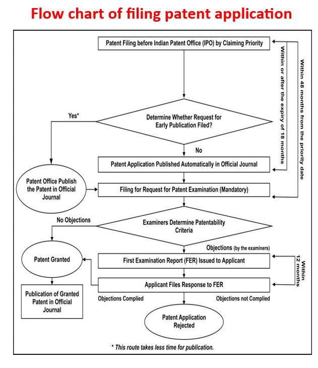
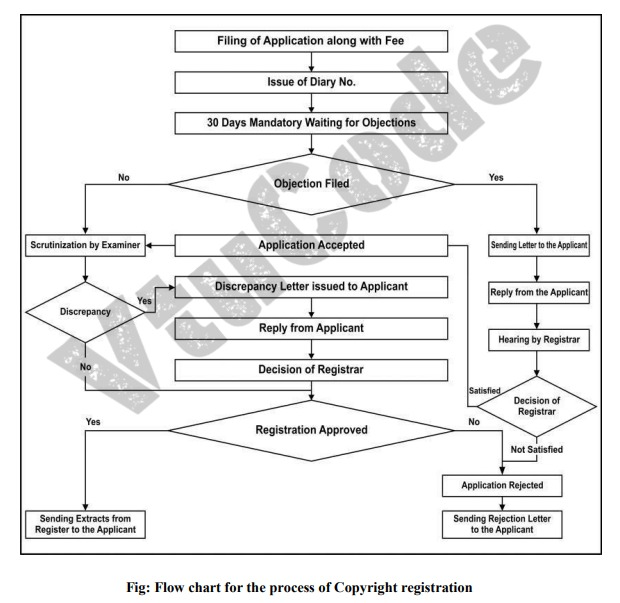
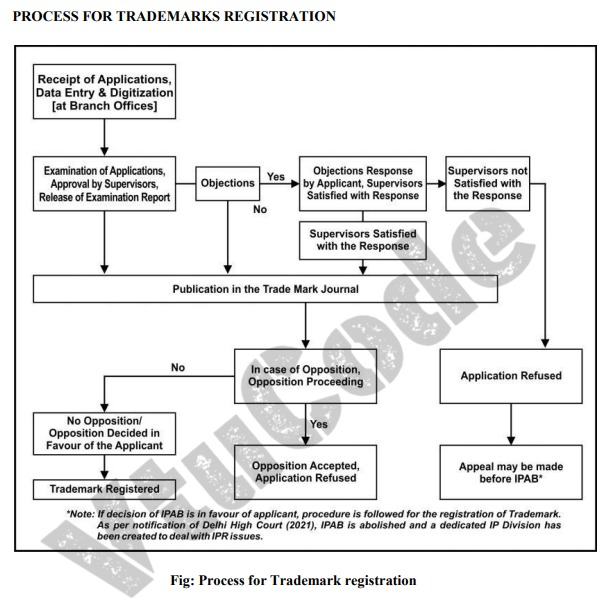
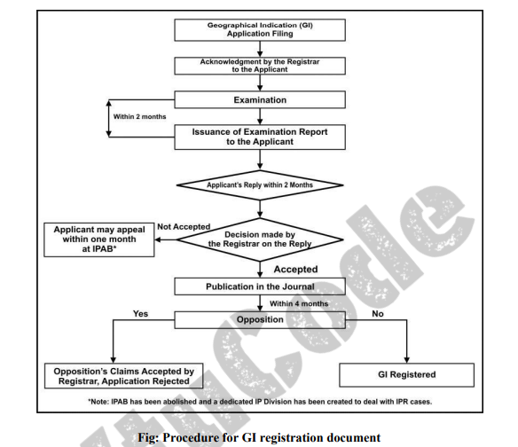

# Question 1: Steps in the Patent Application Process

## **Steps in the Patent Application Process**

### 1. **Prior Art Search**
   - Conduct a **prior art search** to ensure the invention meets patentability criteria:
     - **Novelty**: The invention is new and not disclosed in prior patents or publications.
     - **Inventiveness**: The invention is not obvious to someone skilled in the relevant field.
     - **Industrial Applicability**: The invention has practical utility.
   - Tools for prior art search:
     - Patent databases (e.g., USPTO, WIPO, IPO databases).
     - Scientific and technical literature.

### 2. **Filing the Patent Application**
   - Submit the application to the **Indian Patent Office (IPO)** or another relevant patent authority.
   - Include necessary documents:
     - Specification (provisional or complete).
     - Drawings, claims, and abstract.
     - Priority documents (if claiming priority under the Paris Convention).

### 3. **Publication of the Application**
   - The application is published in the **Official Journal** of the IPO.
   - **Early Publication Request** (optional):
     - If requested, the application is published early.
   - **Automatic Publication**:
     - If no early publication is requested, the application is published **18 months** after the filing or priority date.

### 4. **Request for Examination**
   - Submit a **Request for Examination (RFE)** within **48 months** of the filing or priority date.
   - Examination will not proceed without this request.

### 5. **Examination Process**
   - The **patent examiner** evaluates the application based on:
     - Patentability criteria (novelty, inventiveness, industrial applicability).
     - Compliance with formal requirements.

### 6. **First Examination Report (FER)**
   - If objections are found, the examiner issues a **First Examination Report (FER)**.
   - The report highlights deficiencies or objections regarding patentability or compliance.

### 7. **Applicant Response**
   - The applicant has **12 months** to respond to the FER.
   - Address all objections and provide amendments or clarifications as required.

### 8. **Grant of Patent**
   - **If objections are resolved**: The patent is granted, and details are published in the Official Journal.
   - **If objections are not resolved**: The application is rejected.

---

## **What is Patent Infringement?**
   - **Patent infringement** occurs when someone uses, makes, sells, or distributes a patented invention without the patent holder's permission during the patent's validity period.

### **Types of Infringement**
1. **Direct Infringement**:
   - Unauthorized use or commercialization of a patented invention.
2. **Indirect Infringement**:
   - Assisting, enabling, or encouraging another party to infringe on a patent.
3. **Willful Infringement**:
   - Deliberate violation of patent rights, often attracting enhanced penalties.

### **Legal Remedies for Infringement**
1. **Injunction**:
   - A court order to prevent further infringement.
2. **Damages**:
   - Monetary compensation to cover the patent owner's losses.
3. **Seizure or Destruction**:
   - Confiscation of infringing goods.

### **How to Avoid Infringement?**
   - Conduct thorough **prior art searches**.
   - Obtain **licenses** or permissions when using patented technology.
   - Regularly monitor active patents in the relevant domain.

---
---

# Question 2: Process of Copyright Registration

## **Process of Copyright Registration**

1. **Creation of Work**  
   - The process starts with the creation of an original work, which can include literary, artistic, dramatic, or musical works.

2. **Submission of Application**  
   - The copyright owner or their authorized agent prepares and submits the application form.  
   - Along with the application, prescribed fees are paid to the copyright office.  
   - If the work is unpublished, the applicant must submit two copies of the work.  
   - If the work is published, two copies of the published work need to be provided.

3. **Review of Application**  
   - Once submitted, the copyright office examines the application for completeness and compliance with copyright laws.

4. **Issuance of Diary Number**  
   - Upon submission, a diary number is issued as an acknowledgment of receipt.  
   - The application is then subjected to a waiting period (generally 30 days) for objections or disputes.

5. **Examination of Work**  
   - If no objections are raised during the waiting period, the examiner reviews the application in detail.  
   - If there are objections, they are communicated to the applicant for resolution.

6. **Approval or Rejection**  
   - If the examiner is satisfied that all requirements are met, the application is approved.  
   - Otherwise, the application may be rejected, and the applicant is notified.

7. **Grant of Copyright**  
   - Once approved, the applicant is issued a copyright registration certificate.  
   - The work is now protected under copyright laws, granting exclusive rights to the owner.

---

## **Rights of the Copyright Owner**

1. **Reproduction Rights**  
   - The copyright owner has the exclusive right to reproduce the work in any material form.

2. **Distribution Rights**  
   - The owner can authorize the distribution of copies of the work to the public through sale, rental, or leasing.

3. **Performance and Display Rights**  
   - The owner has the right to perform or display the work publicly, including broadcasting or streaming.

4. **Adaptation Rights**  
   - The copyright owner can create adaptations or derivative works, such as translations or dramatizations.

5. **Communication to the Public**  
   - The owner can authorize the transmission or sharing of the work through any medium, including digital platforms.

6. **Economic Rights**  
   - The owner can monetize the work by licensing or assigning rights to others.

7. **Moral Rights**  
   - These include the right to claim authorship and to object to derogatory treatment of the work that could harm the author's reputation.

8. **Legal Protection Against Infringement**  
   - The owner has the right to take legal action against unauthorized use, reproduction, or distribution of the work.

---
---

# Question 3: Process of Trademark Registration

## **Steps in the Trademark Registration Process**

1. **Prior Art Search**  
   - Before applying, a prior art search is conducted to ensure the trademark is unique and not already registered.  
   - Tools like the Trademark Electronic Search System (TESS) or WIPO’s Global Brand Database can be used.

2. **Application Submission**  
   - The applicant submits the trademark registration application to the appropriate office.  
   - This can be done by the proprietor directly or through an authorized agent.  
   - The application includes the applicant's details, the trademark, and the goods or services it represents.

3. **Issuance of Application Number**  
   - Upon submission, an application number is issued for tracking the status of the application.

4. **Examination of the Application**  
   - The application is examined by a trademark examiner.  
   - If discrepancies or issues are found, the examiner raises objections and communicates them to the applicant.

5. **Response to Objections**  
   - The applicant is required to address and resolve the objections raised by the examiner.  
   - A satisfactory response may result in the application moving forward; otherwise, the application may be rejected.

6. **Publication in the Trademark Journal**  
   - Once approved by the examiner, the application is published in the official Trademark Journal.  
   - This allows the public to view and, if necessary, oppose the trademark within a stipulated period (typically 90 days).

7. **Opposition Proceedings (if any)**  
   - If someone files an opposition against the trademark, both parties are heard, and the trademark office decides the case.  
   - If no opposition is filed or the opposition is resolved in favor of the applicant, the application proceeds.

8. **Grant of Trademark**  
   - After successfully completing all formalities and resolving objections or oppositions, the trademark is registered.  
   - The applicant receives a Trademark Registration Certificate.

9. **Validity of the Trademark**  
   - The trademark is valid for 10 years from the date of registration and can be renewed perpetually for additional 10-year periods.

---
---

# Question 4: Process of Geographical Indication (GI) Registration

## **Steps in the GI Registration Process**

1. **Prior Search**  
   - Conduct a prior search to check if the GI is already registered.  
   - Use tools like WIPO databases or the official CGPDTM website.

2. **Filing the Application**  
   - The application can be filed by individuals, organizations, or authorities under Indian law.  
   - Submit the application in the prescribed format (Form GI-1A) with the prescribed fees to the Registrar of Geographical Indications.  
   - Include necessary documents like a statement of goods, class of goods, and affidavit confirming the interest of producers.

3. **Examination of the Application**  
   - The examiner scrutinizes the application for discrepancies or similarities.  
   - Discrepancies are communicated to the applicant for a response within one month.

4. **Publication in GI Journal**  
   - After clearing the examination, the application is published in the GI Journal.  
   - Any objections must be raised within four months of publication.

5. **Objections and Hearings**  
   - If objections are raised, they are reviewed, and hearings are conducted.  
   - If no objections are filed, the process moves forward.

6. **Registration**  
   - The GI is registered if there are no unresolved objections.  
   - The filing date becomes the date of registration.

7. **Duration and Renewal**  
   - The GI is registered for an initial period of 10 years and can be renewed upon payment of a fee.

---
---

# Question 5: Process for Registering an Industrial Design

## **Steps for Industrial Design Registration**

1. **Prior Art Search**  
   - Conduct a prior art search to ensure the design is novel and has not been registered previously.  
   - Use resources like the Design Search Utility (CGPDTM) and the Global Design Database (WIPO).

2. **Filing an Application**  
   - The application can be filed by individuals, small entities, organizations, or industries.  
   - Non-resident applicants must hire an Indian agent for filing.  
   - Submit the application at the Design Office in Kolkata or through online platforms.

3. **Examination of the Application**  
   - An examiner reviews the application to check compliance with eligibility criteria.  
   - Queries or objections, if any, are communicated to the applicant.

4. **Response to Queries**  
   - The applicant must respond to any queries within six months.  
   - If the objections are resolved satisfactorily, the application proceeds.

5. **Registration and Publication**  
   - Upon acceptance, the design is registered and published in the official Design Journal.

6. **Certificate of Registration**  
   - A certificate is issued to the applicant, granting exclusive rights to the registered design.

7. **Duration of Protection**  
   - The registration is valid for an initial period of 10 years.  
   - It can be renewed for an additional five years through a renewal application.

---

## **Non-Protectable Industrial Designs in India**

1. **Against Public Morality**  
   - Designs that violate public moral values or are scandalous in nature.

2. **National Symbols**  
   - Flags, emblems, or signs of any country.

3. **Integrated Circuits**  
   - Designs of integrated circuits are non-registerable.

4. **Functional Processes**  
   - Designs that describe the process of making an article.

5. **Documents and Printed Matter**  
   - Items like books, calendars, certificates, forms, dressmaking patterns, greeting cards, maps, postcards, and stamps.

6. **Artistic Works**  
   - Artistic works as defined under Section 2(c) of the Copyright Act, 1957, such as:  
     - Paintings, sculptures, and drawings (e.g., diagrams, maps, charts).  
     - Photographs and architectural works.  
     - Works of artistic craftsmanship.

7. **Trademarks and Similar Items**  
   - Designs that are trademarks, property marks, or any other trade-related identifiers.

By adhering to the respective processes and criteria, intellectual property rights can be effectively secured across patents, copyrights, trademarks, GIs, and industrial designs.
