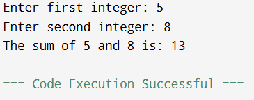
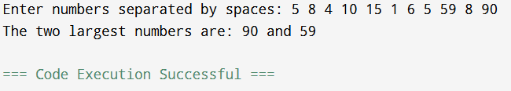
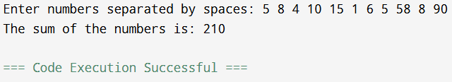
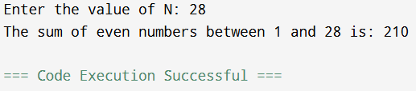
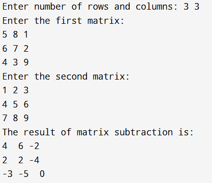
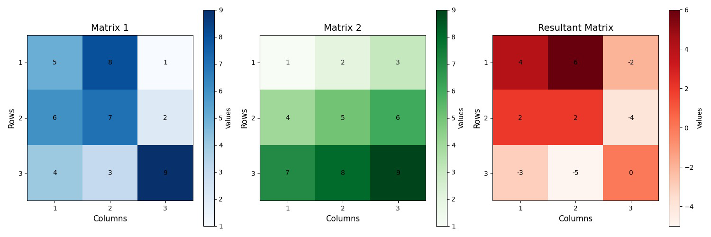

**1. Write a program that takes two integers as user input and prints their sum.**

**Code:**

```python
# Program to take two integers as input and print their sum

# Taking user input
num1 = int(input("Enter first integer: "))
num2 = int(input("Enter second integer: "))

# Calculating the sum
sum_result = num1 + num2

# Printing the result
print("The sum of", num1, "and", num2, "is:", sum_result)
```

**Explanation:**
- The program prompts the user to input two integers.
- It then adds these two numbers and stores the result in `sum_result`.
- Finally, it prints the sum of the two integers.

**Output:**
<p align="center">
    
</p>

---

**2. Write a program to find the largest two numbers from a user input array.**

**Code:**

```python
# Program to find the largest two numbers from an array

# Taking user input for array
arr = list(map(int, input("Enter numbers separated by spaces: ").split()))

# Sorting the array in descending order
arr.sort(reverse=True)

# Printing the two largest numbers
print("The two largest numbers are:", arr[0], "and", arr[1])
```

**Explanation:**
- The program takes a list of numbers as input from the user.
- It sorts the array in descending order using `sort(reverse=True)`.
- It then prints the first two elements, which are the largest numbers in the array.

**Output:**
<p align="center">
    
</p>


---

**3. Write a program that takes a list of numbers and returns their sum.**

**Code:**

```python
# Program to sum a list of numbers

# Taking user input for the list of numbers
numbers = list(map(int, input("Enter numbers separated by spaces: ").split()))

# Calculating the sum of the list
total_sum = sum(numbers)

# Printing the sum
print("The sum of the numbers is:", total_sum)
```

**Explanation:**
- The program prompts the user to input a list of numbers.
- It calculates the sum of the list using Python's built-in `sum()` function.
- Finally, it prints the total sum of the numbers.

**Output:**
<p align="center">
    
</p>


---

**4. Write a program that calculates the sum of all even numbers between 1 to N. N must be user input.**

**Code:**

```python
# Program to calculate the sum of even numbers between 1 to N

# Taking user input for N
N = int(input("Enter the value of N: "))

# Calculating the sum of even numbers
even_sum = sum(range(2, N+1, 2))

# Printing the result
print("The sum of even numbers between 1 and", N, "is:", even_sum)
```

**Explanation:**
- The program takes an integer `N` as input from the user.
- It calculates the sum of all even numbers between 1 and N using `range(2, N+1, 2)` to generate even numbers from 2 to N.
- It then prints the total sum of the even numbers.

**Output:**
<p align="center">
    
</p>


---

**5. Write a program to subtract two matrices of the same size. Display the matrix output and draw the plot for the input data and output data.**

**Code:**

```python
import matplotlib.pyplot as plt
import numpy as np

# Program to subtract two matrices of the same size

# Taking user input for two matrices
rows, cols = map(int, input("Enter number of rows and columns: ").split())

# User input for the first matrix
print("Enter the first matrix:")
matrix1 = []
for i in range(rows):
    matrix1.append(list(map(int, input().split())))

# User input for the second matrix
print("Enter the second matrix:")
matrix2 = []
for i in range(rows):
    matrix2.append(list(map(int, input().split())))

# Subtracting the two matrices
result_matrix = np.subtract(matrix1, matrix2)

# Displaying the result
print("The result of matrix subtraction is:")
for row in result_matrix:
    print(row)

# Function to plot a matrix with numbers displayed and properly labeled axes
def plot_matrix_with_numbers(matrix, title, color_map):
    plt.imshow(matrix, cmap=color_map, interpolation='none', aspect='equal')
    plt.title(title, fontsize=14)
    plt.colorbar(label="Values")
    plt.xlabel("Columns", fontsize=12)
    plt.ylabel("Rows", fontsize=12)
    
    # Ensure axes are integer-only
    rows, cols = matrix.shape
    plt.xticks(ticks=np.arange(cols), labels=np.arange(1, cols + 1))
    plt.yticks(ticks=np.arange(rows), labels=np.arange(1, rows + 1))
    
    # Add numbers on each cell
    for i in range(rows):
        for j in range(cols):
            plt.text(j, i, f'{matrix[i, j]}', ha='center', va='center', color='black', fontsize=10)

# Plotting all matrices
plt.figure(figsize=(15, 5))

# First matrix
plt.subplot(1, 3, 1)
plot_matrix_with_numbers(np.array(matrix1), "Matrix 1", "Blues")

# Second matrix
plt.subplot(1, 3, 2)
plot_matrix_with_numbers(np.array(matrix2), "Matrix 2", "Greens")

# Resultant matrix
plt.subplot(1, 3, 3)
plot_matrix_with_numbers(np.array(result_matrix), "Resultant Matrix", "Reds")

# Adjust layout for better spacing
plt.tight_layout()
plt.show()

```

**Explanation:**
- The program first takes the dimensions of the matrices from the user.
- It then asks for the two matrices as input from the user.
- Using `numpy`, it subtracts the second matrix from the first.
- The result is displayed as a matrix, and then the program plots both matrices using `matplotlib` to visualize them.

**Output:**
<p align="center">
    
    
</p>


---
