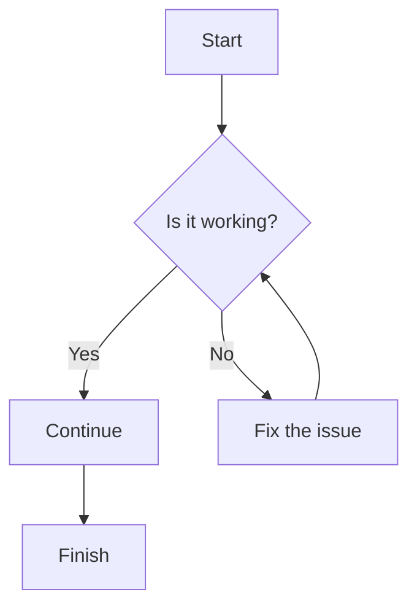
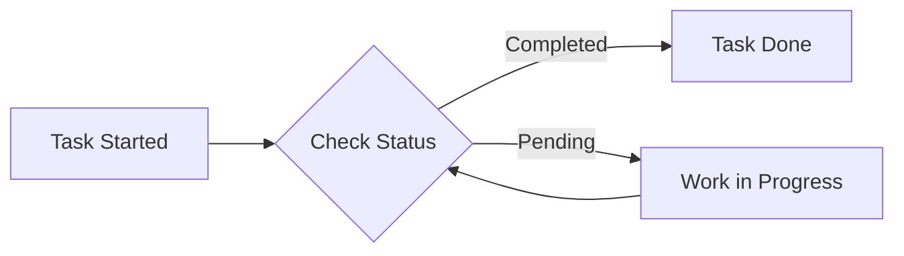
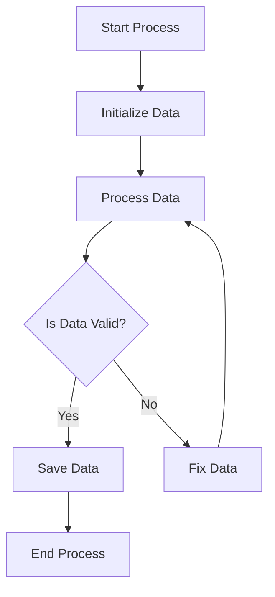

# Mermaid Block Diagram Example

Mermaid is a JavaScript-based diagramming and charting tool that can be used to generate block diagrams, flowcharts, and more directly in Markdown. Below are examples of how to use Mermaid to generate block diagrams.

## Block Diagram Syntax

To create a block diagram with Mermaid, you can use the following syntax:

### Explanation:
- `graph TD` indicates a top-down graph.
- `A[Start]`, `B{Is it working?}`, etc., define the blocks.
- `-->` indicates a directional arrow between blocks.
- The syntax `|Yes|` and `|No|` inside the arrow denotes conditional flow.

## Example: A Simple Workflow

This example shows how to visualize a simple workflow for a task:

### Explanation:
- `graph LR` indicates a left-to-right graph.
- The workflow checks the status of a task and directs to either completion or pending.

## Example: Process Block Diagram

A more complex block diagram can represent a process flow.

### Explanation:
- The process starts, initializes data, processes it, and checks for validity before either saving the data or fixing it.

## Rendering Mermaid Diagrams

To render Mermaid diagrams:
- You need a platform that supports Mermaid, such as GitHub, GitLab, or some Markdown editors like Typora or Visual Studio Code with appropriate extensions.
